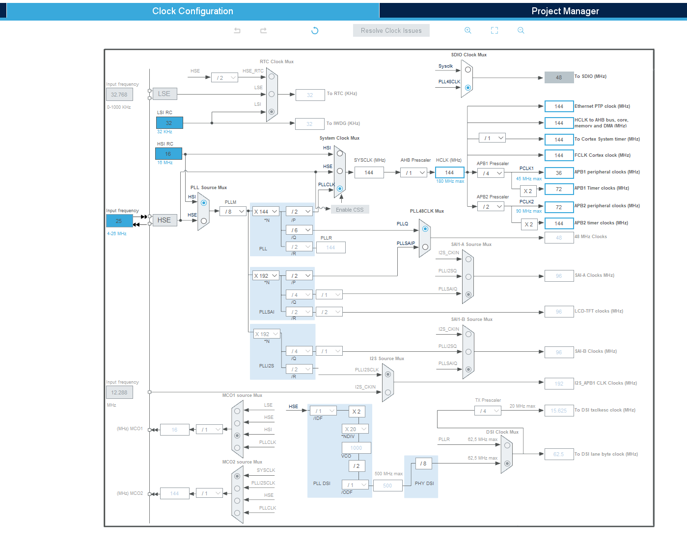
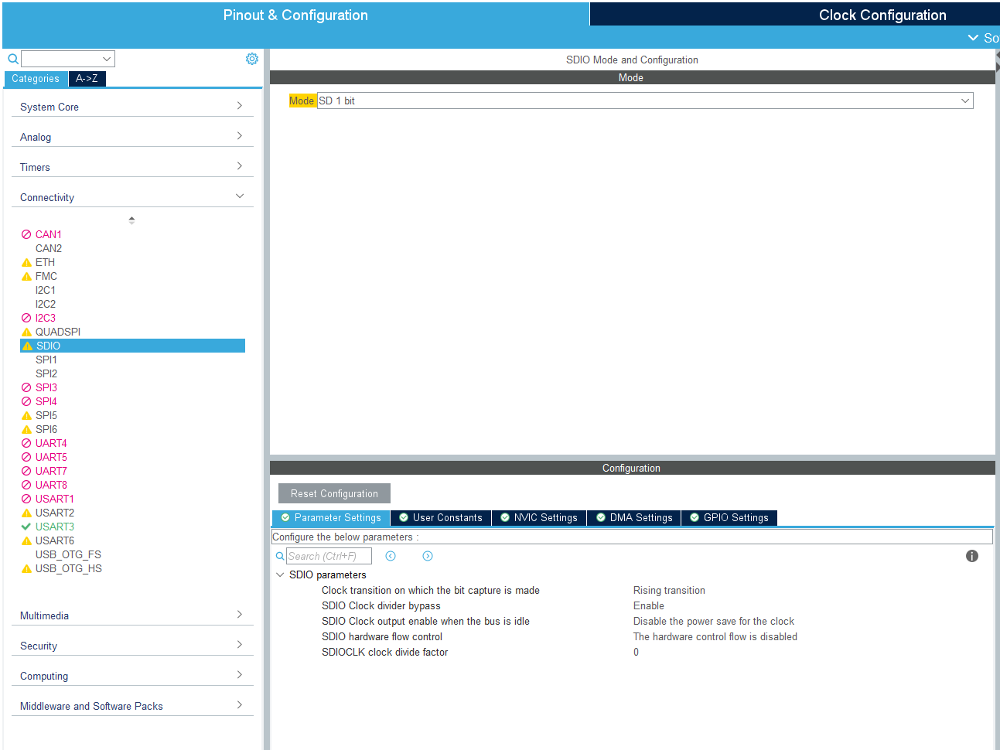
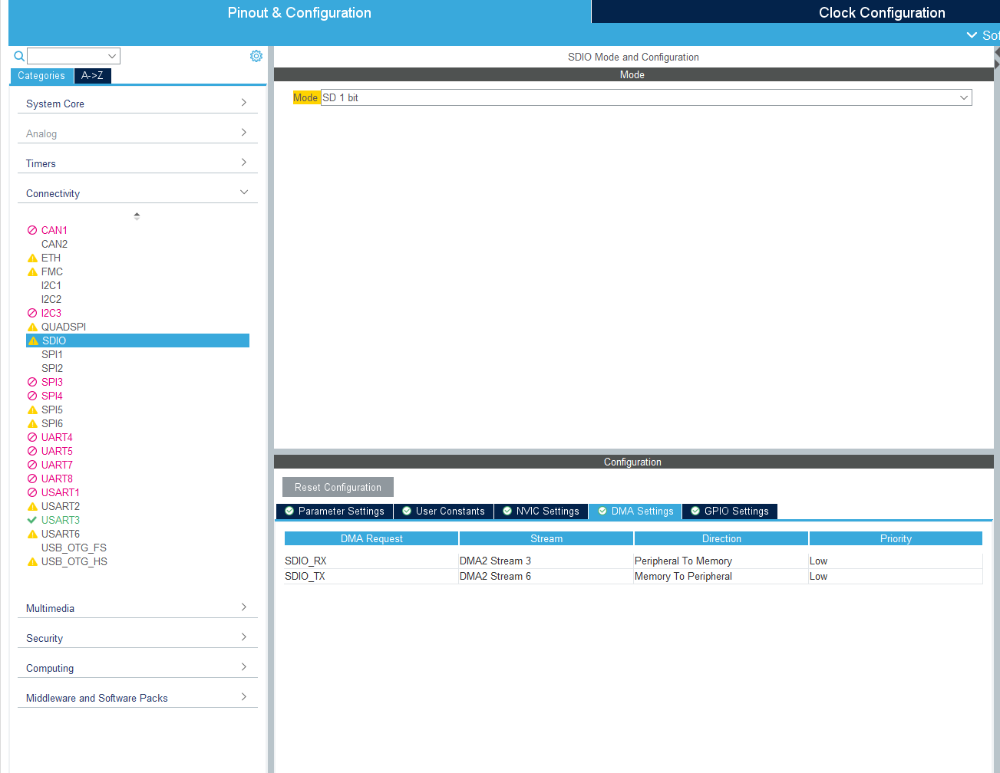
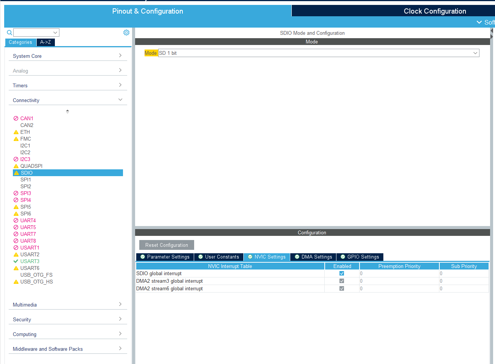
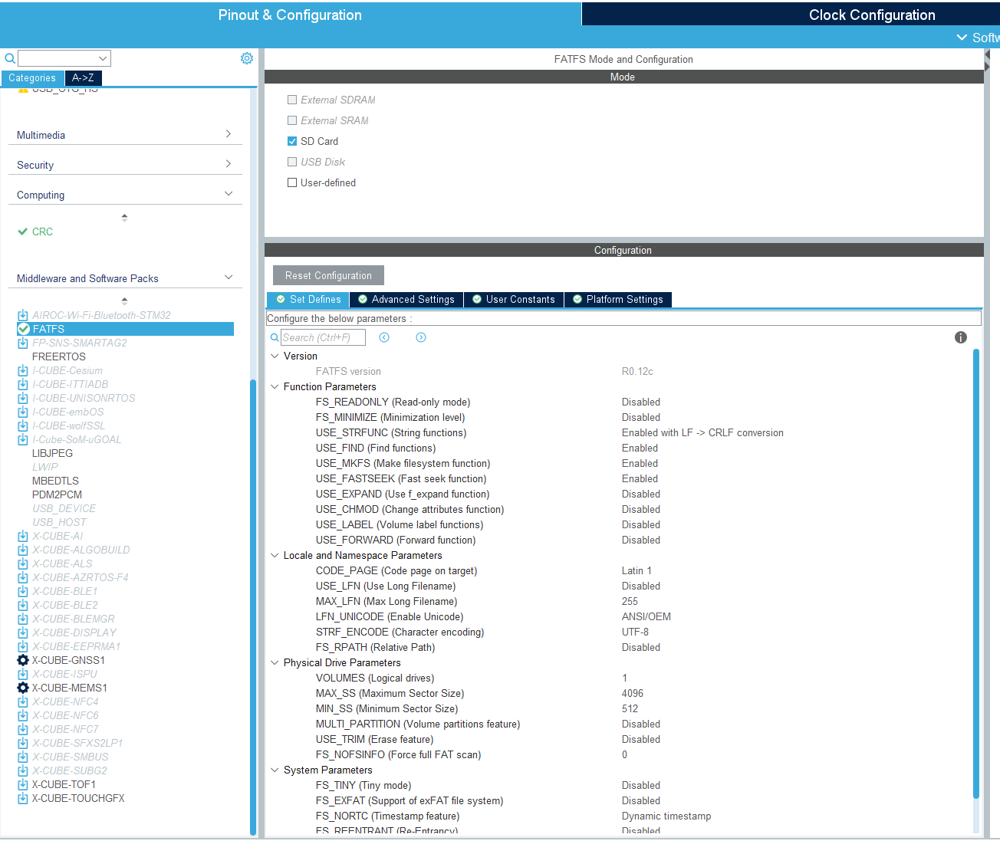
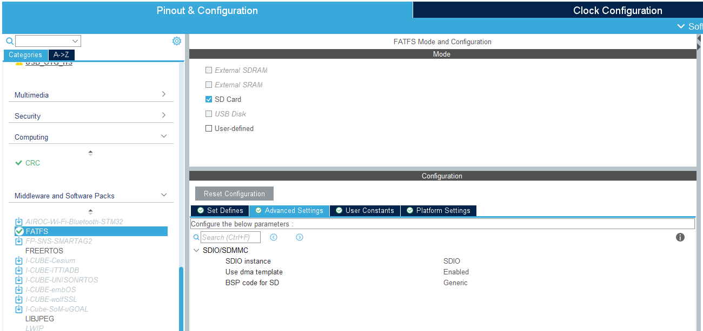

# STM32 - uSD - SDIO 4bit - DMA
Since there is a known firmware issue in using SDIO in 4bit mode with DMA with the code generated by CubeMX for stm32, here a detailed instruction on how to make it work anyways. 
This repo contains instructions (this reamde), an example code for STM32 in uSD_SpeedTest_DMA folder, and also includes a jupyter notebook that can be used to check the test data written on the uSD card. 

# Structure
```
data
evaluate_uSDCard_write_speed.ipynb
markdown_images
uSD_SpeedTest_DMA
└── Core
└── Debug
└── Drivers
└── FATFS
└── Middlewares
└── myLib
```

# What is the performance of SDIO 4bit mode
In our tests, we achieved about 2.4MByte/s write speed


# Attention
Even though we are using **DMA** the writing of the data happens in blocking mode.
Here explained why:

Structure of the code
```
└── writeSDCardFile() - (sd.c)
    └── f_write() - (ff.c)
        └── disk_write() - (diskio.c)
            └── sd_write() - (sd_diskio.c)
                └── BSP_SD_WriteBlocks_DMA() - (bsp_driver_sd.c)
```

`sd_write()` calls `BSP_SD_WriteBlocks_DMA()` but does not return until the DMA callback `BSP_SD_WriteCpltCallback(void)` is reached.


# Requirements
STM32 Discovery board or NUCLEO Board (or similar) with uSD card reader. For SDIO usage, the uSD card reader should expose all the uSD card pins.
This example has been created using a [STM32-F469I Discovery board](https://www.st.com/en/evaluation-tools/32f469idiscovery.html)

To code the project, [STM32 Cube IDE](https://www.st.com/en/development-tools/stm32cubeide.html)

A uSD card

# Project Setup

In Cube IDE, create a blank project for the corresponding Eval Board.

## 1 Set the clock to the desired frequency, make sure `SDIO Clock` is 48MHz



## 2 Enable SDIO 
Make sure to set it to `SD 1 bit mode`. We will change it to `SD 4 bit mode` in the code, otherwise it will not initialize correctly.
`Clock divider Bypass` can be enabled or disabled.
`SDIOCLK clock divide factor` -> The SDIO CLK will be 48MHz/(SDIOCLK factor + 2)


Enable the DMA channels `SDIO_RX` and `SDIO_TX`


Enable the `SDIO global interrupt`


## 3 Enable FATFS
To allow search function (required for the speed test) enable `USE_FIND`
Set `MAX_SS` to 4096


Enable the `Use DMA template`


# Generate the code
Then, in `fatfs.h` add 
```
/* USER CODE BEGIN Prototypes */
void MX_FATFS_DeInit(void);
/* USER CODE END Prototypes */
```
and in `fatfs.c`
```
/* USER CODE BEGIN Application */
void MX_FATFS_DeInit(void)
{
	retSD = FATFS_UnLinkDriver(SDPath);
}
/* USER CODE END Application */
```
# Include code
The following code has to be included in order to use the SDIO 4 bit mode. Don't forget to add them to the include path.
```
myLib
    └── SD
    └── myDiskio
```

# The magic
As we know, code that is set up in `SDIO 4bit mode` does not recognise the SD card. 
This is why we configure the project in `SDIO 4bit mode` and then change it in `mountSDCard()` after the `hsd` has been initialized, how suggested by F. Belaid [here](https://community.st.com/t5/stm32cubemx-mcus/sdio-interface-not-working-in-4bits-with-stm32f4-firmware/td-p/591776). We just moved the code to the mount section.
```
void mountSDCard(FRESULT *fr, FATFS *SDFatFs) {
	if(isSDCardInserted())
	{
		if (HAL_SD_Init(&hsd) != HAL_OK)
		{
			Error_Handler();
		}

		if (HAL_SD_ConfigWideBusOperation(&hsd, SDIO_BUS_WIDE_4B) != HAL_OK)
		{
			Error_Handler();
		}
		/*
```

# Usage

Insert uSD card.
Run the code once, it should write 100 files to the uSD card and track the write speed.
After writing is completed, the file `TIMESTAT.bin` will also be written to the uSD card and contain the data rate in MByte/s

After the data has been written to the uSD card, insert the card into the PC and copy the data into ./data folder in this repo, and use [evaluate_uSDCard_write_speed.ipynb](evaluate_uSDCard_write_speed.ipynb) to evaluate the data.
The code will first check consistency of all the data written in the files.
Then, it will print the data rate statistics.

# Contributing

Pull requests are welcome. For major changes, please open an issue first
to discuss what you would like to change.

Please make sure to update tests as appropriate.

# License

[Apache 2.0](LICENSE.txt)
